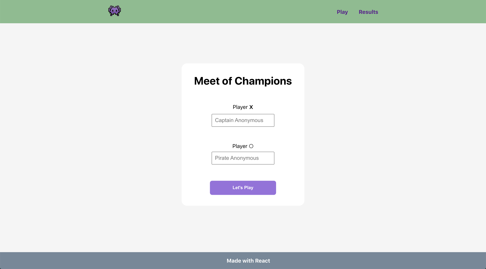
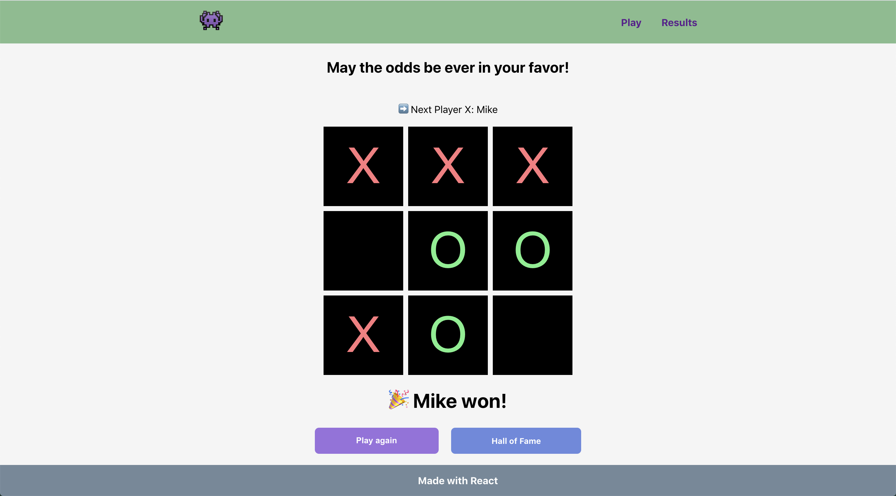

##  Tic Tac Toe App : ReactJS

Deployed with Netlify [Tic Tac Toe](https://60ca45735475491a45e8657f--tic-tac-toe-difmkv.netlify.app/).

This project was bootstrapped with [Create React App](https://github.com/facebook/create-react-app).


## Screenshot




## Available Scripts

In the project directory, you can run:

```bash
npm i
```
Installs packages that it depends on.

```bash
npm start
```
Runs the app in the development mode.

```bash
npm test
```
Launches the test runner in the interactive watch mode.